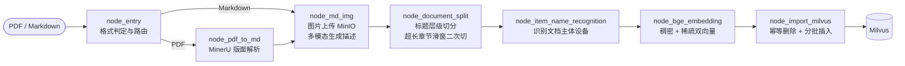
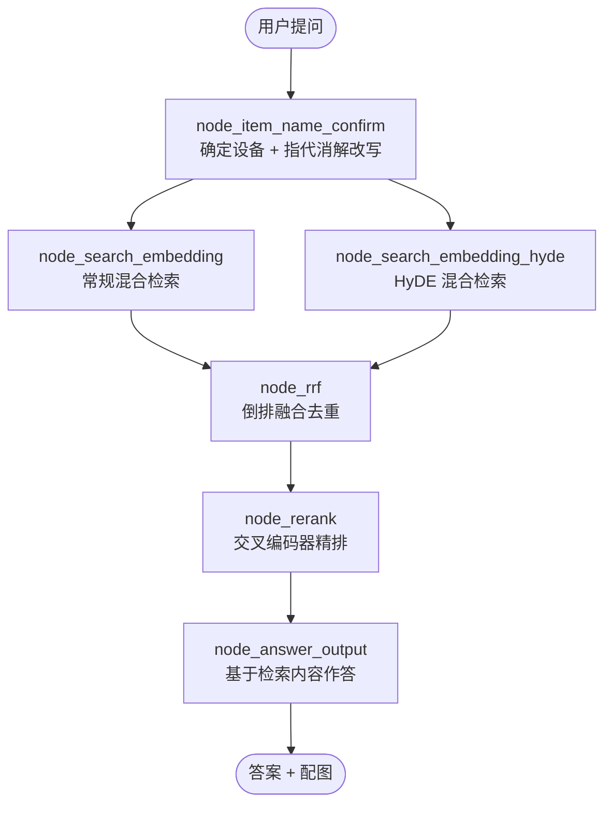

# RAG Knowledge QA

> 设备手册知识库问答系统。把路由器、打印机、笔记本的 PDF 用户手册解析入库，
> 用户用中文自然语言提问，系统经多路混合检索与交叉编码器精排后，
> 基于手册原文作答，并附上相关的接线图、面板图。


<!-- 录好演示 GIF 后，把下面这行的注释符去掉即可 -->
<!--  -->

---

## 这个项目解决什么问题

设备手册是 RAG 场景里最难啃的一类文档：几百页、大量表格与示意图、
章节层级混乱、关键信息常常只存在于图片里。把 PDF 粗暴地按固定长度切块
丢进向量库，召回质量会差到不可用。

| 真实场景的难点 | 本项目的应对 |
| --- | --- |
| PDF 版面复杂，表格与多栏排版直接抽文本会错乱 | MinerU 做版面解析，还原成结构化 Markdown |
| 按固定长度切块会把一句话、一张表从中间劈开 | 按 Markdown 标题层级切分，超长章节再按句末边界滑窗二次切分 |
| 关键信息在图里，纯文本检索完全看不见 | 多模态模型结合上下文为每张图生成描述，随段落一起向量化 |
| 型号、错误码（`KFR-35GW`、`E-05`）语义检索命中率低 | BGE-M3 稠密 + 稀疏双向量混合检索，稀疏向量专治字面匹配 |
| 用户的问法和手册的措辞对不上 | HyDE：先让模型写一段假设性答案，再拿它去检索 |
| 多份手册里的同名章节互相干扰 | 先识别用户问的是哪台设备，再用标量过滤把范围锁到一份手册 |
| 向量检索只能判断「是否同一话题」 | 交叉编码器精排，判断「是否真的回答了这个问题」 |
| 知识库没有答案时模型会编 | 精排结果为空时直接返回固定话术，根本不调用模型 |

---

## 系统架构

### 离线：文档导入链路



### 在线：查询问答链路



---

## 三个核心设计决策

### 一、稠密与稀疏双向量，而非只用稠密

稠密向量擅长语义匹配：用户问「机器卡纸了怎么办」，能召回标题写着
「清除卡住的介质」的段落——字面零重合，语义高度相关。

但设备手册里充斥着 `KFR-35GW`、`E-05` 这类型号和错误码。这些符号串本身
没有语义，稠密向量对它们的区分度极差，而稀疏向量（本质是可学习的 BM25）
能精确命中。

BGE-M3 的价值正在于**一次前向传播同时产出两种向量**，省掉了维护两套模型、
跑两次编码的开销。检索时用 `WeightedRanker` 按 0.6 / 0.4 加权融合，
融合前先做分数归一化——稠密走 COSINE（值域 −1~1）、稀疏走 IP（值域无上界），
不归一化的话稀疏分数会直接淹没稠密分数，权重形同虚设。

### 二、HyDE：用假设性答案去检索，而不是用问题

向量检索本质是比较两段文本的相似度，但**问题和答案在文本形态上差异很大**。
用户问「打印出来有横条纹怎么办」，手册里对应的段落写的是「若打印结果出现
规律性横向条纹，请执行打印头清洗程序」。问句 vs 陈述句、口语 vs 术语，
直接比相似度并不高。

HyDE 先让模型凭常识写一段假想的标准答案——它是陈述句、带专业术语的，
和手册段落形态同构，向量距离自然更近。**即使模型编造的细节是错的也不要紧**：
它只用于检索，最终答案仍然完全基于真实检索到的手册内容生成。

代价是多一次 LLM 调用。所以它与常规检索**并行**执行，两路耗时重叠，
端到端只多出一次模型调用的时间。

### 三、RRF 融合 + 交叉编码器精排

两路召回的分数**不可比**——一路查的是问题、一路查的是范文，文本长度和
语义密度都不同，强行加权求和等于在比较两把刻度不同的尺子。
RRF（Reciprocal Rank Fusion）只看名次不看分数，对分数分布免疫。
常数 `k=60` 压平了头部差距，让融合更看重「在多路中都靠前」而非
「在某一路里排第一」。

融合之后还要精排，因为前面的向量检索是**双塔模型**：问题和切片各自独立编码，
从头到尾没有交互，模型无法判断「这段话是否真的回答了这个问题」，
只能判断「它们大体上是不是一个话题」。

交叉编码器把问题和切片拼成一条输入一起过模型、逐层做注意力交互，判别精度
高得多，但无法预计算——每个候选都要单独推理。所以标准做法是两段式：
**双塔负责从海量数据里快速捞出几十条候选（保召回），交叉编码器负责在这
几十条里挑出真正对题的几条（保精度）**。

---

## 技术栈

| 分层 | 选型 |
| --- | --- |
| 流程编排 | LangGraph，导入与查询两条独立的 `StateGraph` |
| 版面解析 | MinerU（PDF → 结构化 Markdown） |
| Embedding | BGE-M3，一次编码产出稠密 + 稀疏双向量 |
| 重排序 | BGE-Reranker-Large 交叉编码器 |
| 向量库 | Milvus，`WeightedRanker` 混合检索 + 标量过滤 |
| 对象存储 | MinIO，图片托管并生成公网 URL |
| 大模型 | 通义千问（DashScope），含视觉模型用于图片理解 |
| 会话存储 | MongoDB |
| 图谱（预留） | Neo4j |

---

## 快速开始

### 1. 准备依赖服务

```bash
docker compose up -d
```

### 2. 下载本地模型

```bash
python -m app.tool.download_bgem3       # BGE-M3 向量模型
python -m app.tool.download_reranker    # BGE-Reranker 重排模型
```

### 3. 配置环境变量

```bash
cp .env.example .env
```

关键配置项：

```ini
OPENAI_API_KEY=your_api_key_here
OPENAI_BASE_URL=https://dashscope.aliyuncs.com/compatible-mode/v1
LLM_DEFAULT_MODEL=qwen-flash
VL_MODEL=qwen3-vl-flash

BGE_M3_PATH=/path/to/your/local/resource
BGE_DEVICE=cuda:0

MILVUS_URL=http://127.0.0.1:19530
CHUNKS_COLLECTION=kb_chunks

MINIO_ENDPOINT=localhost:9000
MINIO_ACCESS_KEY=your_access_id_here
MINIO_SECRET_KEY=your_secret_here

MINERU_API_TOKEN=your_token_here
```

> 仓库内不含任何真实密钥，全部凭据经环境变量注入，`.env` 由 `.gitignore` 拦截。
> 语料目录 `doc/`（约 700MB 的 PDF）同样不入版本库。

### 4. 导入文档

```bash
python -m app.import_process.agent.main_graph
```

### 5. 提问

```bash
python -m app.query_process.agent.main_graph
```

或在代码中调用：

```python
from app.query_process.agent.main_graph import answer_question

result = answer_question("MateBook B3-410 怎么进入 BIOS")
print(result["answer"])
print(result["image_urls"])
```

---

## 项目结构

```
├── app/
│   ├── import_process/agent/       # 导入链路
│   │   ├── main_graph.py           #   图定义：节点、边、条件路由
│   │   ├── state.py                #   导入链路状态
│   │   └── nodes/                  #   7 个导入节点
│   ├── query_process/agent/        # 查询链路
│   │   ├── main_graph.py           #   图定义 + 对外问答入口
│   │   ├── state.py                #   查询链路状态
│   │   └── nodes/                  #   6 个查询节点 + 检索公共逻辑
│   ├── clients/                    # Milvus / MinIO / MongoDB / Neo4j 连接管理
│   ├── lm/                         # Embedding、Reranker、LLM 客户端
│   ├── conf/                       # 各组件配置，统一从环境变量读取
│   ├── core/                       # 日志、提示词加载
│   ├── tool/                       # 模型下载脚本
│   └── utils/                      # 路径、转义、稀疏向量归一化、SSE、任务追踪
├── prompts/                        # 提示词模板，与代码分离
├── doc/                            # PDF 语料（不入版本库）
└── docker-compose.yml
```

---

## 工程实践

- **导入与查询链路分离**：两条链路各有独立的 `StateGraph` 与状态定义。两者关心的数据几乎没有交集，硬塞进同一个状态字典会让每个节点都要面对一堆无关字段。
- **入库幂等**：按 `item_name` 先删后插。同一份手册改几个字重新导入，若直接插入会新旧并存，检索时同一段内容占掉多个名额，把本该召回的其他片段挤出去——这类问题表现为「答案看着没错就是不全」，极难排查。
- **向量维度不写死**：建集合时从实际生成的向量读取维度，避免配置项写错导致建表与写入对不上。
- **降级而非中断**：图片处理、主体识别、HyDE 检索、精排任一环节失败都只降级不中断——图片是增强项，主体识别失败可退化为文件名，HyDE 失败还有常规检索兜底，精排失败可退回 RRF 排序。
- **提示词与代码分离**：全部提示词存放于 `prompts/`，调整措辞无需改代码、无需重启。
- **并行分支返回局部状态**：两路检索节点只返回自己负责的字段而非完整状态——LangGraph 会合并各分支返回值，若都返回完整状态等于对每个字段并发写入，没配 reducer 的字段会直接抛 `InvalidUpdateError`。

---

## 评测结果

> 🚧 评测体系建设中，指标将在此处更新。

| 指标 | 说明 |
| --- | --- |
| 检索 Recall@K | 正确切片是否进入召回结果 |
| 精排 Precision@5 | 送进模型的上下文中有多少真正相关 |
| 答案准确率 | 是否基于手册原文正确作答 |
| 拒答准确率 | 知识库无相关内容时是否如实告知 |
| 端到端延迟 | 含两路检索与精排的总耗时 |

---

## Roadmap

- [ ] **评测体系**：构建覆盖多设备、多难度的黄金问答集，量化各环节贡献
- [ ] **消融实验**：分别关闭 HyDE、稀疏向量、精排，量化每个组件的实际增益
- [ ] **父子块检索**：召回小块保证精度，送入模型时回查父块补全上下文
- [ ] **图谱检索接入**：`node_query_kg` 已在任务映射中预留，接入 Neo4j 多跳关系查询
- [ ] **流式输出**：答案生成改为流式返回，缩短用户感知延迟
